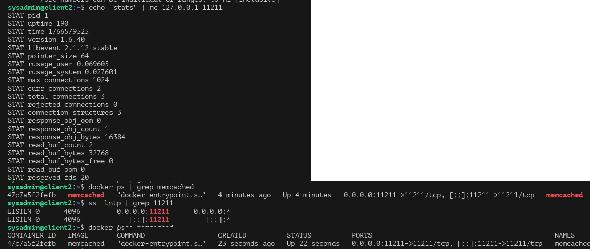
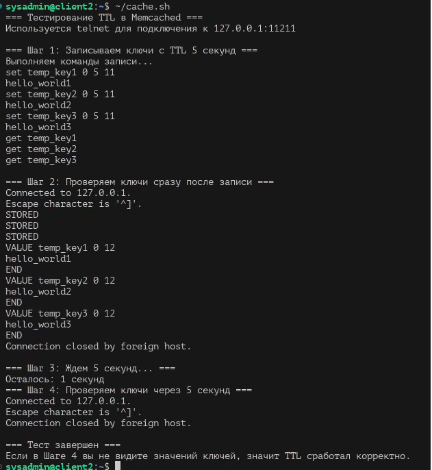
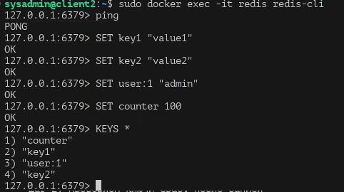
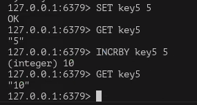

# Домашнее задание к занятию «Кеширование Redis/memcached» - Протопопов Николай Андреевич

### Инструкция по выполнению домашнего задания

   1. Сделайте `fork` данного репозитория к себе в Github и переименуйте его по названию или номеру занятия, например, https://github.com/имя-вашего-репозитория/git-hw или  https://github.com/имя-вашего-репозитория/7-1-ansible-hw).
   2. Выполните клонирование данного репозитория к себе на ПК с помощью команды `git clone`.
   3. Выполните домашнее задание и заполните у себя локально этот файл README.md:
      - впишите вверху название занятия и вашу фамилию и имя
      - в каждом задании добавьте решение в требуемом виде (текст/код/скриншоты/ссылка)
      - для корректного добавления скриншотов воспользуйтесь [инструкцией "Как вставить скриншот в шаблон с решением](https://github.com/netology-code/sys-pattern-homework/blob/main/screen-instruction.md)
      - при оформлении используйте возможности языка разметки md (коротко об этом можно посмотреть в [инструкции  по MarkDown](https://github.com/netology-code/sys-pattern-homework/blob/main/md-instruction.md))
   4. После завершения работы над домашним заданием сделайте коммит (`git commit -m "comment"`) и отправьте его на Github (`git push origin`);
   5. Для проверки домашнего задания преподавателем в личном кабинете прикрепите и отправьте ссылку на решение в виде md-файла в вашем Github.
   6. Любые вопросы по выполнению заданий спрашивайте в чате учебной группы и/или в разделе “Вопросы по заданию” в личном кабинете.
   
Желаем успехов в выполнении домашнего задания!
   
### Дополнительные материалы, которые могут быть полезны для выполнения задания

1. [Руководство по оформлению Markdown файлов](https://gist.github.com/Jekins/2bf2d0638163f1294637#Code)

---
#Комманды для работы с GIT
1. git clone https://github.com/Nikolay-Protopopov/homework-zabbix.git
2. cd homework-zabbix 
3. mkdir screenshots
4. git add README.md screenshots/ 
5. git commit -m "Добавлены скриншоты и обновлен README"
6. git remote set-url origin "https://мой токен@github.com/Nikolay-Protopopov/homework-zabbix.git"
7. git push origin main

### Задание 1 Кеширование
Приведите примеры проблем, которые может решить кеширование.
Кеширование решает целый ряд практических проблем, связанных с производительностью, нагрузкой и стабильностью систем. Ниже приведены основные примеры.

Низкая производительность при частых вычислениях
Если результат сложного вычисления или запроса часто используется и редко меняется (например, расчёт отчёта или агрегация данных), кеширование позволяет не выполнять вычисление каждый раз, а брать готовый результат из памяти.

Высокая нагрузка на базу данных
При большом количестве однотипных запросов (например, чтение справочников, настроек, карточек товаров) кеш снижает количество обращений к БД, уменьшая нагрузку и ускоряя отклик системы.

Медленный доступ к внешним сервисам
Запросы к API сторонних сервисов могут быть медленными или ограниченными по количеству (rate limit). Кеширование ответов позволяет сократить задержки и избежать превышения лимитов.

Задержки при сетевом взаимодействии
Кеширование данных на стороне клиента или ближе к пользователю (например, CDN) уменьшает сетевые задержки и ускоряет загрузку страниц и ресурсов.

Пики нагрузки (burst traffic)
Во время резкого роста числа пользователей кеш позволяет выдержать нагрузку, так как большая часть запросов обслуживается без обращения к «тяжёлым» компонентам (БД, сервисам).

Повышение отказоустойчивости
При временной недоступности базы данных или внешнего сервиса система может продолжать работать, используя ранее закешированные данные.

Оптимизация использования ресурсов
Кеширование снижает нагрузку на CPU, диск и сеть, что особенно важно для высоконагруженных и распределённых систем.

Ускорение пользовательского интерфейса
Кеширование шаблонов, результатов рендеринга или данных на клиенте делает интерфейс более отзывчивым и улучшает пользовательский опыт.

В целом, кеширование помогает находить баланс между актуальностью данных и производительностью системы, существенно повышая её эффективность.
Приведите ответ в свободной форме.
### Задание 2 Memcached
Установите и запустите memcached.

Приведите скриншот systemctl status memcached, где будет видно, что memcached запущен.
Установка через docker.

### Задание 3 Удаление по TTL в Memcached
Запишите в memcached несколько ключей с любыми именами и значениями, для которых выставлен TTL 5.

### Задание 4 Запись данных в Redis
Запишите в Redis несколько ключей с любыми именами и значениями.

Через redis-cli достаньте все записанные ключи и значения из базы, приведите скриншот этой операции.

### Задание 5*. Работа с числами
Запишите в Redis ключ key5 со значением типа "int" равным числу 5. Увеличьте его на 5, чтобы в итоге в значении лежало число 10.

Приведите скриншот, где будут проделаны все операции и будет видно, что значение key5 стало равно 10.

